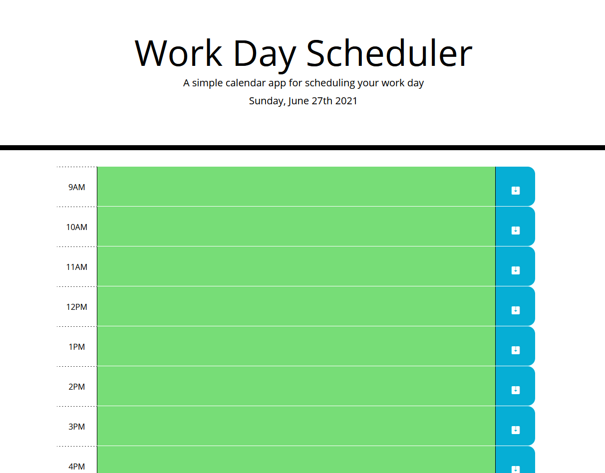

## Challenge Five Work Day Scheduler 

### Description
For this challenge, we were tasked with setting up a work day scheduler, set from 9AM - 5PM, that will dynamically update the colors of each text area based on the time of day. Saved notes must also perist. The time blocks were created in HTML and styled using exsiting CSS and Bootstrap. Each timeblock was checked against the current time using Moment.js and this function was set to an interval so it would update without needing to refresh the page. Various other functions were added to save and load the notes so the data persists. 

### Screenshot 

### Link
https://logandufek.github.io/ChallengeFiveWorkDayScheduler/
